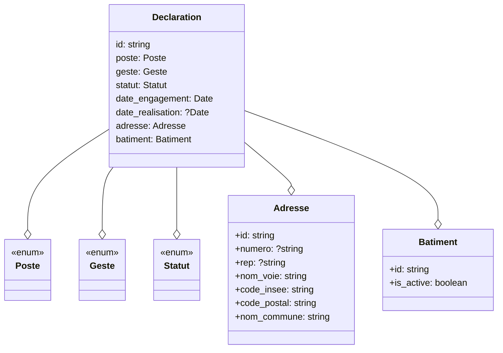

# Modèle de données publiques

Le modèle de données publiques du Référentiel National des Travaux est construit autour des concepts de Poste et de Geste :

- Un Poste désigne une catégorie ou un ensemble de travaux regroupés par type d'intervention ou par zone du bâtiment.
- Un Geste désigne une action spécifique ou à une intervention technique visant à améliorer la performance énergétique d'un bâtiment.

## Règles

Un Geste DOIT être identifiable (unicité).

Un Geste DOIT être associé à UNIQUEMENT UN Poste (oneToMany).

Un Geste DOIT être anonyme.

Un Geste PEUT être associé à un ou plusieurs entreprises de travaux.

Un Geste DOIT renseigner son état d'avancement.

Un Geste DOIT avoir une date.

Un Geste NE DOIT PAS avoir de doublon.

Un Geste DOIT être localisable.

Un Geste DOIT être associé à un bâtiment référencé au Référentiel National des Bâtiments

## Description des données

### Modèle commun

- Identifiant unique du Geste au RNT
- Dénomination du Poste
- Dénomination du Geste
- Statut du Geste :
  - Geste engagé
  - Geste achevé
- Date d'engagement du Geste :
  - Date de signature du devis OU date de début des travaux (auto rénovation)
- Date de réalisation du Geste :
  - Date de la facture OU date de fin des travaux (auto rénovation)
- Adresse du logement ayant fait l'objet des travaux
- Identifiant du bâtiment au Référentiel National des Bâtiments
- Entreprises de travaux ayant assuré la mise en oeuvre du Geste (facultatif) :
  - Raison sociale
  - Siret

### Modèle - Isolation

- Quantité d'isolant installé exprimé en m²
- Réistance thermique de l'isolant installé exprimé en m².K/W

### Modèle - Générateurs à combustion

- Quantité installé
- Puissance nominale du générateur installé exprimée en kW
- Efficacité énergétique saisonnière exprimée en %

### Modèle - Généateurs électriques

- Quantité installé
- Puissance nominale du générateur installé exprimée en kW

### Modèle - Pompes à chaleur

- Quantité installé
- Puissance nominale du générateur installé exprimée en kW
- Coefficient de performance énergétique saisonnier

## Modélisation

