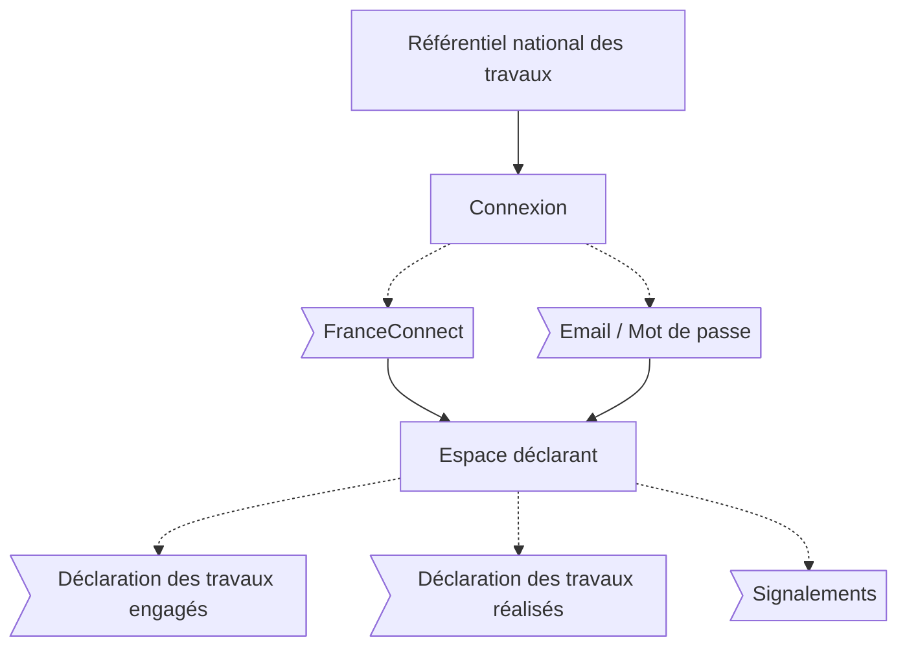

# Parcours usagers

L'usager est ici identifié comme le maître d'ouvrage.

## Interface

Plateforme officielle du Référentiel National des Travaux de Rénovation.

## Étapes

### Connexion

- FranceConnect (recommandé)
- Email / Mot de passe

### Déclaration des travaux engagés

- Description des travaux
- Renseignement des entreprises (facultatif)

### Déclaration des travaux réalisés

- Description des travaux
- Renseignement des entreprises (facultatif)

### Signalements

- Malfaçons
- Tentative de fraude

### Lien de partage des travaux

- Financement
- Contrôle
