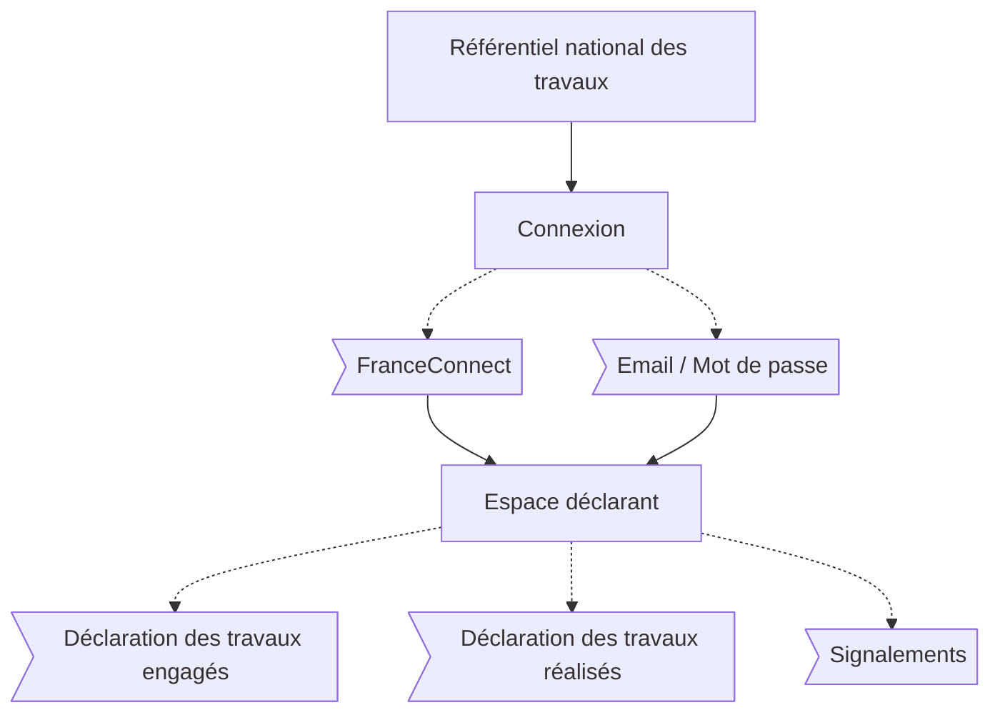

# Parcours usagers

L'usager est ici identifié comme le maître d'ouvrage.

## Interface

Plateforme officielle du Référentiel National des Travaux de Rénovation.

## Vue d'ensemble

## Actions

### Connexion

- FranceConnect (recommandé)
- Email / Mot de passe

### Déclaration d'un geste engagé

#### Prérequis

- [Connexion](#connexion)

#### Étapes

1. Sélection du poste de travaux
2. Sélection du geste de travaux
3. Description des travaux
4. Validation

### Déclaration d'un geste réalisé

#### Prérequis

- [Connexion](#connexion)
- [Déclaration d'un geste engagé](#déclaration-dun-geste-engagé)

#### Étapes

1. Sélection du geste engagé
2. Correction des informations
3. Validation

### Signalements

#### Prérequis

- [Connexion](#connexion)
- [Déclaration d'un geste engagé](#déclaration-dun-geste-engagé)

#### Étapes

1. Sélection du geste engagé ou réalisé
2. Description du signalement
3. Validation

### Partage des informations

#### Prérequis

- [Connexion](#connexion)
- [Déclaration d'un geste engagé](#déclaration-dun-geste-engagé)

#### Étapes

1. Sélection du geste engagé ou réalisé
2. Génération du lien de partage
